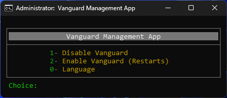

# Vanguard Management App

---

🌐 **Language / Dil:** [English](README.md) | [Türkçe](docs/README.tr.md)

💡 **The file is clean on VirusTotal:**  
[VirusTotal scan](https://www.virustotal.com/gui/file/92a252bf6b99b025ec6fdc3c4915fe6329a366c43b124953323851fd78f43e50?nocache=1)

A lightweight management tool designed for easy setup and control of Vanguard services.

## Features
- Easy installation and setup  
- Start/Stop Vanguard service with one click  
- Automatic configuration handling  
- Simple and user-friendly interface  

## Installation
1. Download the latest release from the [Releases](../../releases) page.  
2. Run the setup file as Administrator.  
3. Follow the on-screen instructions.  

## Usage
- Launch the app from the Start Menu or Desktop.  
- Use the control panel to start, stop, or manage Vanguard services.  

## License
This project is licensed under the MIT License.  
See the [LICENSE](LICENSE) file for details.
